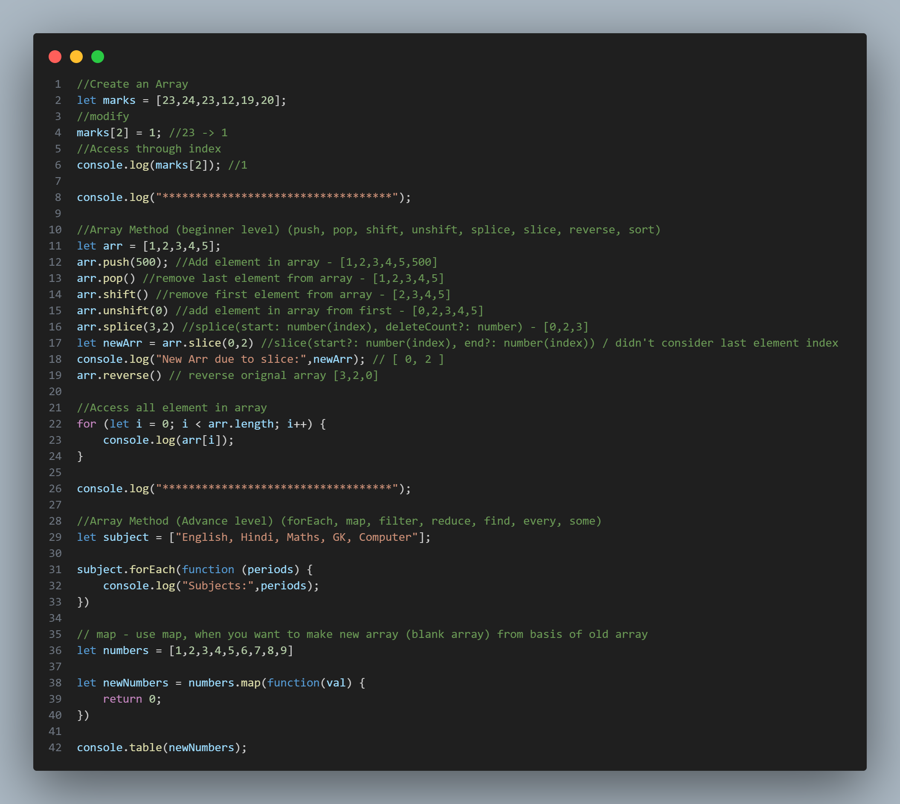
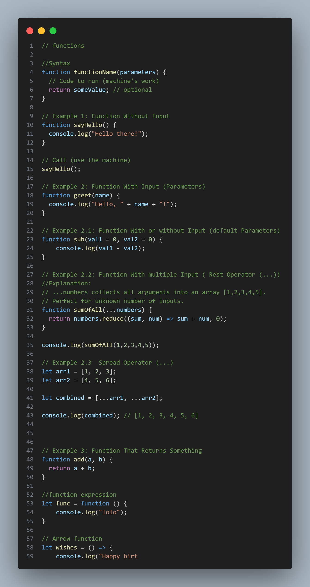
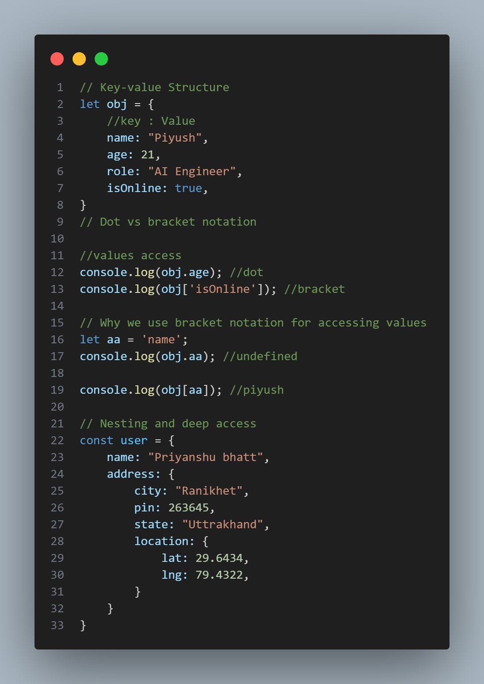

# JavaScript Learning Repository

This repository is a collection of **JavaScript practice files and lecture notes**.  
Each file covers a specific topic, starting from the basics and gradually moving to advanced concepts.  
The goal is to build a strong foundation in JavaScript for web development and beyond.## 📸 Screenshots

### Array Example
Output of `11_Arrays.js`:


### Functions Example
Output of `10_function.js`:


### Objects Example
Output of `12_Objects.js`:


## 📂 Contents

| File                      | Topic                                          |
| ------------------------- | ---------------------------------------------- |
| `01_variables.js`         | Variables & constants                          |
| `02_datatypes.js`         | Primitive & reference data types               |
| `03_conversion.js`        | Type conversion in JS                          |
| `04_operations.js`        | Basic operations (arithmetic, comparison)      |
| `06_datatypes_summary.js` | Summary of data types                          |
| `07_nums_and_math.js`     | Numbers, Math object                           |
| `08_Condition.js`         | Conditionals (if, else, switch)                |
| `09_loops.js`             | Loops (for, while, do-while, for...of)         |
| `10_function.js`          | Functions & scope                              |
| `11_Arrays.js`            | Arrays & common methods                        |
| `12_Objects.js`           | Objects & their operations                     |
| `guide.js`                | General practice / guide file                  |
| `index.html`              | Simple HTML file to link/execute JS in browser |

## Run Locally

Clone the project

```bash
  https://github.com/pbbhattpriyanshu/JavaScript-.git
```

Go to the project directory

```bash
  JavaScript-Learning
```

Start the server

```bash
  node 01_variables.js
```


## 🎯 Goals

1. Learn JavaScript step by step.

2. Practice coding with small, focused examples.

3. Prepare for real-world projects and advanced topics like React, Node.js, and AI integrations.

## 🧠 Learning Notes

- Each file is numbered in recommended learning order.

- Files are short and focused—read comments inside for explanations.

- Missing numbers (like 05) are reserved for future lessons.


## 📌 Future Topics
- ES6+ Features (let/const, arrow functions, spread/rest operators)

- Promises & Async/Await

- DOM Manipulation

- Event Handling

- LocalStorage & SessionStorage
## License

This repository is for educational purposes. Feel free to learn!


